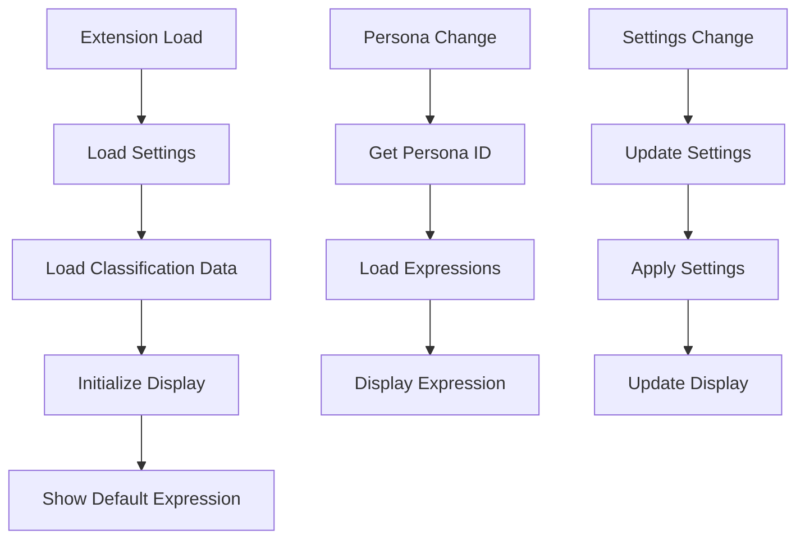
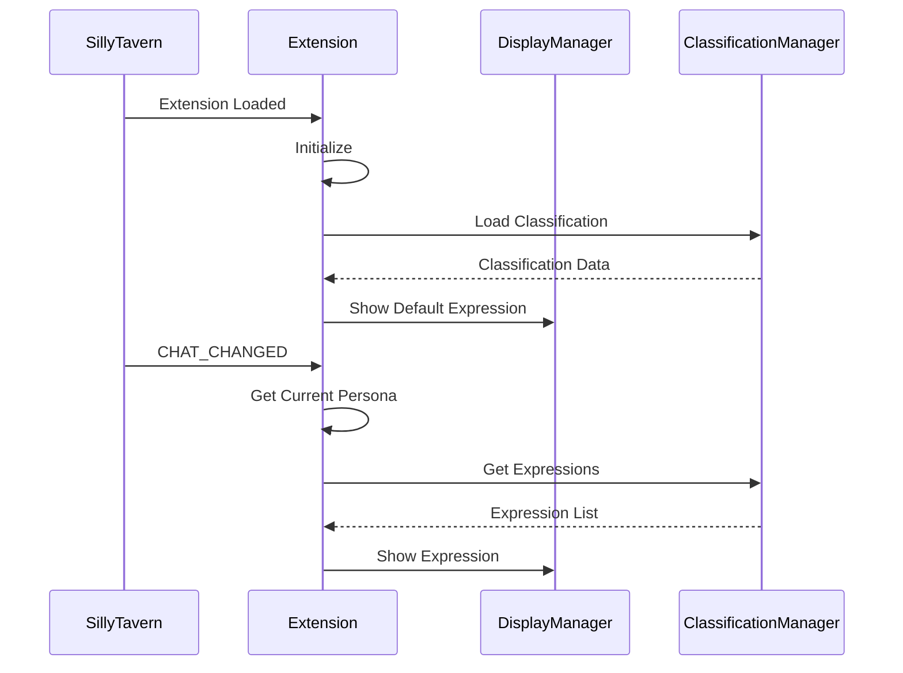
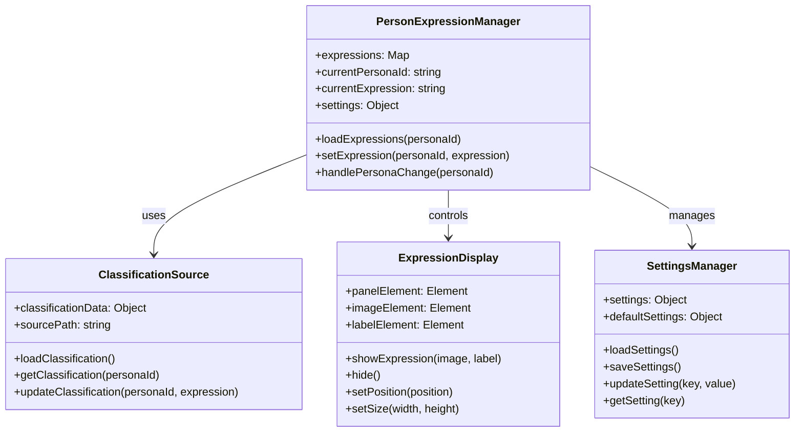
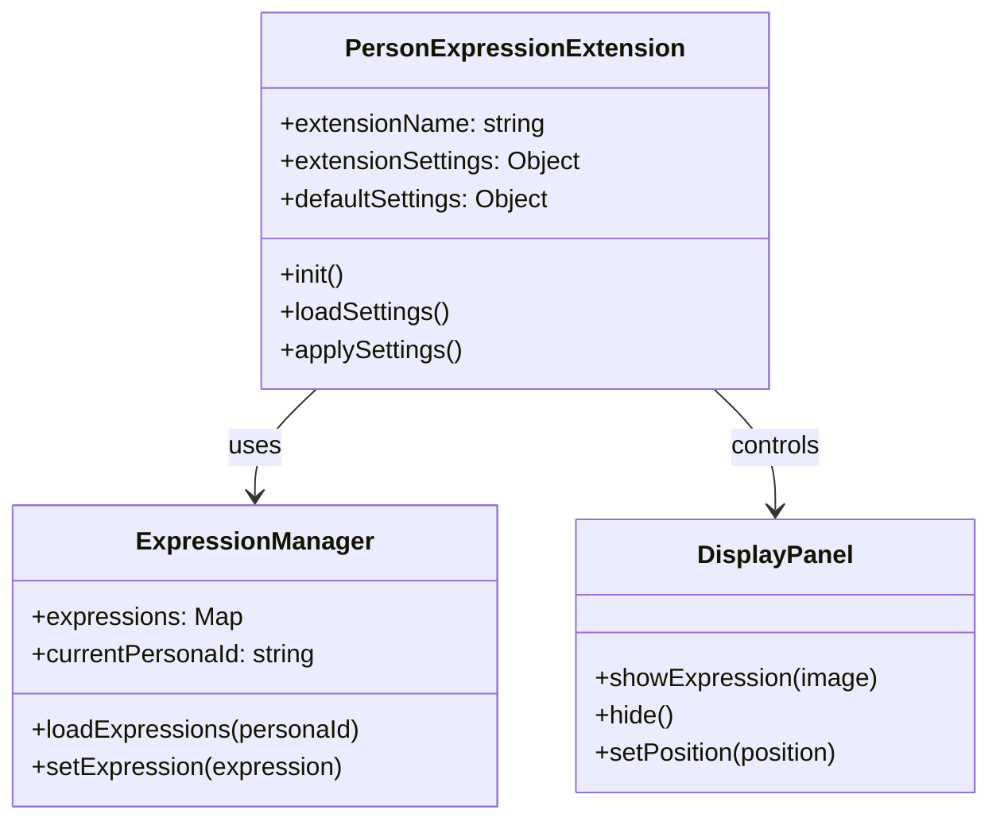

# Person Expression Extension - Architecture

## Overview

This document describes the architecture of the Person Expression extension for SillyTavern. The extension provides expression image management for personas, similar to the Character Expression extension but with enhanced support for persona-based workflows.

## File Structure

```
PersonExpressionExtension/
├── manifest.json          # Extension metadata and configuration
├── index.js              # Main extension logic
├── settings.html         # Settings panel UI
├── style.css             # Extension styles
├── assets/
│   ├── placeholder.png   # Default expression image
│   └── icons/
│       └── (optional icons)
└── README.md             # Extension documentation
```

## Core Components

### 1. Extension Manifest ([`manifest.json`](manifest.json))

```json
{
    "display_name": "Person Expression",
    "loading_order": 10,
    "requires": [],
    "optional": [],
    "js": "index.js",
    "css": "style.css",
    "author": "YourName",
    "version": "1.0.0",
    "homePage": "https://github.com/yourusername/person-expression"
}
```

### 2. Main Extension Logic ([`index.js`](index.js))

The main JavaScript file contains all extension functionality.

#### Key Classes and Objects

##### `PersonExpressionManager`

Manages expression images for personas.

**Properties:**
- `expressions` - Map of persona IDs to expression images
- `currentPersonaId` - Currently active persona ID
- `currentExpression` - Currently displayed expression
- `settings` - Extension settings

**Methods:**
- `loadExpressions(personaId)` - Load expressions for a persona
- `setExpression(personaId, expression)` - Set current expression
- `getNextExpression(personaId)` - Get next expression for persona
- `handlePersonaChange(personaId)` - Handle persona switch

##### `ClassificationSource`

Handles classification data from local source.

**Properties:**
- `classificationData` - Loaded classification data
- `sourcePath` - Path to classification source

**Methods:**
- `loadClassification()` - Load classification data
- `getClassification(personaId)` - Get classification for persona
- `updateClassification(personaId, expression)` - Update classification

##### `ExpressionDisplay`

Manages the expression display panel UI.

**Properties:**
- `panelElement` - DOM element for panel
- `imageElement` - DOM element for image
- `labelElement` - DOM element for expression label

**Methods:**
- `showExpression(image, label)` - Display expression
- `hide()` - Hide panel
- `setPosition(position)` - Set panel position
- `setSize(width, height)` - Set panel size

##### `SettingsManager`

Manages extension settings.

**Properties:**
- `settings` - Current settings object
- `defaultSettings` - Default settings values

**Methods:**
- `loadSettings()` - Load settings from storage
- `saveSettings()` - Save settings to storage
- `updateSetting(key, value)` - Update a setting
- `getSetting(key)` - Get a setting value

### 3. Settings UI ([`settings.html`](settings.html))

Settings panel with the following sections:

- **General Settings**
  - Enable/disable extension
  - Display position
  - Auto-hide behavior

- **Expression Source**
  - Classification source path
  - Manual expression assignment

- **Display Settings**
  - Panel width and height
  - Transition effects
  - Label visibility

### 4. Styles ([`style.css`](style.css))

CSS styles for:
- Panel container
- Expression image
- Settings panel
- Animations

## Data Flow



## Event Flow



## Class Interactions



## Extension Points

### SillyTavern Integration Points

1. **Settings Panel** - Append to `#extensions_settings`
2. **Main Container** - Append panel to `#root`
3. **Event System** - Listen to `CHAT_CHANGED`, `MESSAGE_RECEIVED`, etc.
4. **Storage** - Use `extensionSettings` for persistence

### Future Extension Points

1. **Expression Triggers** - Hook into sentiment analysis
2. **Multi-Persona Support** - Extend for group chats
3. **Custom Sources** - Support URL and file browser

## POC Architecture

For the initial proof of concept, implement:

1. **PersonExpressionManager** - Core expression management
2. **ClassificationSource** - Local classification integration
3. **ExpressionDisplay** - Basic panel display
4. **SettingsManager** - Basic settings handling

Simplified class diagram for POC:



## Implementation Order

1. **Phase 1: Core Structure**
   - Create manifest.json
   - Create basic index.js structure
   - Create settings.html
   - Create style.css

2. **Phase 2: Basic Display**
   - Implement ExpressionDisplay class
   - Add basic settings management
   - Test panel display

3. **Phase 3: Classification Integration**
   - Implement ClassificationSource class
   - Load classification data
   - Map personas to expressions

4. **Phase 4: Event Handling**
   - Listen to chat events
   - Update expressions on persona change
   - Handle edge cases

5. **Phase 5: Polish**
   - Add smooth transitions
   - Improve settings UI
   - Add error handling
   - Optimize performance

## Dependencies

- SillyTavern v0.1.0+
- jQuery (bundled with SillyTavern)
- SillyTavern extension API

## Notes

- Follow SillyTavern extension best practices
- Use debounced settings save
- Handle missing expressions gracefully
- Support both character and persona workflows
- Ensure backward compatibility
